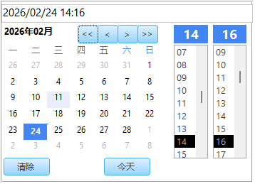
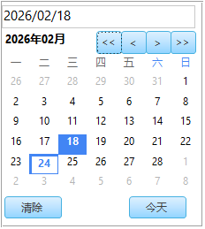
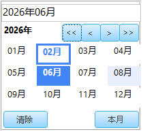

# Access DatePicker / Access 日期选择器

> 纯 VBA 实现的 Microsoft Access 日期选择器和年月选择器 — 零外部依赖，一键部署。
>
> A pure VBA date picker and year-month picker for Microsoft Access — zero external dependencies, one-click deployment.

[中文](#-功能特性) | [English](#-features)


---

**日期选择器：**




**年月选择器：**



---

## ✨ 功能特性

- **纯 VBA + Access 窗体实现** — 无 ActiveX，无 WebBrowser 控件，无外部库
- **日历网格** + 上/下月导航
- **时间选择器**（小时 & 分钟列表） — 可显示或隐藏
- **年月选择器** — 十年/年份导航 + 4×3 月份网格
- **自动创建窗体** — 一条命令即可，无需手动设计
- **表达式事件绑定** — 窗体代码模块为零
- **下拉模式** — 可绑定任意文本框作为非模态弹出
- **双击**日期/月份格子即可确认并关闭
- 兼容 **Access 2010 / 2013 / 2016 / 2019 / 365**，32 位 & 64 位，`.accdb` & `.mdb`

## 📋 环境要求

| 依赖 | 版本要求 |
|------|----------|
| Microsoft Access | 2010 / 2013 / 2016 / 2019 / 365 |
| Windows | 7 / 8 / 10 / 11 |
| 架构 | 32 位 或 64 位均可 |
| 数据库格式 | `.accdb` 或 `.mdb` |
| 外部依赖 | 无 |

## 🚀 快速开始

### 步骤 1：导入模块

1. 打开你的 Access 数据库（`.accdb` / `.mdb`）
2. 按 **Alt + F11** 打开 VBA 编辑器
3. 菜单选择 **文件 → 导入文件**
4. 选择 `Module_DatePicker.bas`（和/或 `Module_YearMonthPicker.bas`）
5. 点击 **打开** 完成导入

### 步骤 2：创建选择器窗体

1. 在 VBA 编辑器中按 **Ctrl + G** 打开立即窗口
2. 输入以下命令并按回车：

```vb
CreateDatePickerForm
```

3. 看到 **"创建成功"** 提示框即可

> ⚠️ 此命令只需执行一次，窗体 `frmDatePicker` 会永久保存在数据库中

年月选择器也需要执行：

```vb
CreateYearMonthPickerForm
```

### 步骤 3：调用选择器

#### 日期选择器

```vb
' 选择日期+时间（默认当前时间）
Dim dt As Variant
dt = ShowDatePicker()

If Not IsNull(dt) Then
    MsgBox "您选择了: " & dt
End If
```

```vb
' 仅选择日期（隐藏时间选择器）
dt = ShowDatePicker(Now, False)
```

```vb
' 指定默认日期
dt = ShowDatePicker(#2026-2-23 15:30:00#)
```

#### 绑定文本框

```vb
Private Sub cmdPickDate_Click()
    Dim dt As Variant
    If IsNull(Me.txtDate.Value) Then
        dt = ShowDatePicker()
    Else
        dt = ShowDatePicker(Me.txtDate.Value)
    End If
    If Not IsNull(dt) Then
        Me.txtDate.Value = dt
    End If
End Sub
```

#### 年月选择器

```vb
' 模态对话框
Dim dt As Variant
dt = ShowYearMonthPicker()
If Not IsNull(dt) Then
    MsgBox Format(dt, "yyyy年mm月")   ' 如 "2026年02月"
End If
```

```vb
' 绑定文本框（非模态下拉）
Private Sub txtMonth_Click()
    PickYearMonthFor Me.txtMonth, "yyyy-mm"
End Sub
```

```vb
' 在 Form_Load 中一行代码绑定
Private Sub Form_Load()
    AttachYearMonthPicker Me, "txtMonth", "yyyy年mm月"
End Sub
```

```vb
' 无代码绑定（在属性表的"双击"事件中填写表达式）
=PickYearMonthForCtl("frmOrder","txtMonth","yyyy-mm")
```

## 📁 项目结构

```
access-datepicker/
├── Module_DatePicker.bas       # 日期选择器 VBA 模块（日期+时间选择）
├── Module_YearMonthPicker.bas  # 年月选择器 VBA 模块（年份+月份选择）
├── DatePicker.accdb            # 示例 Access 数据库（含已部署的选择器窗体）
├── 使用说明.md                  # 详细中文使用说明文档
└── README.md                   # 项目说明文档
```

## 🔧 核心模块说明

### 模块概览

| 模块 | 功能 | 窗体名 |
|------|------|--------|
| `Module_DatePicker.bas` | 日期+时间选择器 | `frmDatePicker` |
| `Module_YearMonthPicker.bas` | 年月选择器 | `frmYearMonthPicker` |

### 公开 API

#### `ShowDatePicker([dtDefault], [bShowTime])`

| 参数 | 类型 | 必填 | 默认值 | 说明 |
|------|------|------|--------|------|
| `dtDefault` | Variant | 否 | `Now` | 默认日期时间 |
| `bShowTime` | Boolean | 否 | `True` | 是否显示时间选择器 |

**返回值：** 确认时返回 `Date`，取消/清除时返回 `Null`。

#### `ShowYearMonthPicker([dtDefault])`

| 参数 | 类型 | 必填 | 默认值 | 说明 |
|------|------|------|--------|------|
| `dtDefault` | Variant | 否 | `Now` | 默认日期（取其年月部分） |

**返回值：** 所选月份第 1 天的日期（如 `2026-02-01`），或 `Null`。

#### `PickYearMonthFor(ctl, [sFormat])`

| 参数 | 类型 | 必填 | 默认值 | 说明 |
|------|------|------|--------|------|
| `ctl` | Control | 是 | — | 要绑定的文本框控件 |
| `sFormat` | String | 否 | `""` | 输出格式（默认 `yyyy-mm`） |

#### `AttachYearMonthPicker(frm, sCtlName, [sFormat])`

| 参数 | 类型 | 必填 | 默认值 | 说明 |
|------|------|------|--------|------|
| `frm` | Form | 是 | — | 窗体对象 |
| `sCtlName` | String | 是 | — | 控件名称 |
| `sFormat` | String | 否 | `""` | 输出格式 |

### 自定义修改

#### 修改颜色

在 `Module_DatePicker.bas` 模块顶部修改颜色常量：

```vb
Private Const CLR_BLUE As Long = 16024898   ' 主题色: RGB(66,133,244)
```

#### 修改窗体大小

运行 `CreateDatePickerForm` 前，在代码中调整布局参数：

```vb
Dim CW As Long: CW = 480   ' 格子宽度
Dim CH As Long: CH = 340   ' 格子高度
```

### 常见问题

| 问题 | 解决方法 |
|------|----------|
| `CreateDatePickerForm` 报错 | 确保数据库未以只读方式打开，关闭所有窗体后重试 |
| 时间列表不显示 | 确认调用时使用 `ShowDatePicker(Now, True)` |
| 想重新生成窗体 | 直接再次运行 `CreateDatePickerForm`，会自动删除旧窗体并重建 |
| 如何在宏中使用 | 在宏的 "RunCode" 操作中调用 `ShowDatePicker()`（宏无法接收返回值，建议用 VBA） |

## 🗺️ 路线图

- [x] 日期选择器（日历网格 + 时间列表）
- [x] 年月选择器（4×3 月份网格）
- [x] 自动创建窗体，一键部署
- [x] 表达式事件绑定，零窗体代码
- [x] 下拉模式绑定文本框
- [x] 32 位 & 64 位兼容
- [ ] 多语言支持（英文 / 日文等）
- [ ] 日期范围选择（起止日期）
- [ ] 自定义主题配色方案
- [ ] 周起始日设置（周一 / 周日）

## 🐛 问题反馈

如果发现 Bug 或有改进建议，请：

- 提交 [Issue](https://github.com/miaowei2/accessdevelop/issues)
- 详细描述问题或建议
- 如可能，提供复现步骤

## 📄 许可证

本项目采用 MIT 许可证 - 详见 [LICENSE](LICENSE) 文件

## 👨‍💻 作者

**缪炜（will miao）**

现任微软最有价值专家（MVP），自媒体博主（公众号Access开发）

微软官方MVP主页地址：[@MVP](https://mvp.microsoft.com/zh-CN/MVP/profile/15c78eb8-1d9d-42de-9c15-afba24ec931d)
拥有丰富的企业级开发与培训经验，曾服务多家外企及知名合资企业，包括：麦格纳电子 (Magna)、飞利浦电子 (Philips)、卡特彼勒 (Caterpillar)、硕腾 (Zoetis)等。

项目经验：深耕企业数字化解决方案，通过 Access 独立架构或者其他语言开发过 ERP（企业资源计划）、WMS（仓储管理）、MES（生产执行）、CRM（客户关系）及 HR 等核心业务系统，具备极强的实战落地能力。熟悉：VBA、C#、JavaScript、SQL等开发语言。

## 📮 联系方式

- GitHub: [@miaowei2](https://github.com/miaowei2)
- email:will.miao@edonsoft.com
- 公众号：Access开发
- B站：[@Access开发易登软件](https://space.bilibili.com/10580232?spm_id_from=333.1007.0.0)
- 公司网站：[www.edonsoft.com](http://www.edonsoft.com)

## 🙏 致谢

感谢所有使用和贡献本项目的开发者！

---

# English

> A pure VBA date picker and year-month picker for Microsoft Access — zero external dependencies, one-click deployment.


**Date Picker:**


**Year-Month Picker:**


## ✨ Features

- **Pure VBA + Access Forms** — no ActiveX, no WebBrowser control, no external libraries
- **Calendar grid** with previous/next month navigation
- **Time picker** (hour & minute lists) — can be shown or hidden
- **Year-Month picker** with decade/year navigation and 4×3 month grid
- **Auto-create forms** via a single command — no manual design needed
- **Event binding via expressions** — zero form code module required
- **Dropdown mode** — attach to any text box as a non-modal popup
- **Double-click** a date/month cell to confirm and close instantly
- Compatible with **Access 2010 / 2013 / 2016 / 2019 / 365**, 32-bit & 64-bit, `.accdb` & `.mdb`

## 📋 Requirements

| Dependency | Version |
|------------|---------|
| Microsoft Access | 2010 / 2013 / 2016 / 2019 / 365 |
| Windows | 7 / 8 / 10 / 11 |
| Architecture | 32-bit or 64-bit |
| Database format | `.accdb` or `.mdb` |
| External dependencies | None |

## 🚀 Quick Start

### Step 1: Import the Module

1. Open your Access database (`.accdb` / `.mdb`)
2. Press **Alt + F11** to open the VBA Editor
3. Go to **File → Import File**
4. Select `Module_DatePicker.bas` (and/or `Module_YearMonthPicker.bas`)
5. Click **Open**

### Step 2: Create the Picker Form

1. In the VBA Editor, press **Ctrl + G** to open the Immediate Window
2. Type the following and press Enter:

```vb
CreateDatePickerForm
```

3. A success message box will appear

> ⚠️ You only need to run this once. The form `frmDatePicker` is permanently saved in your database.

For the Year-Month Picker, also run:

```vb
CreateYearMonthPickerForm
```

### Step 3: Use the Picker

#### Date Picker

```vb
' Pick date + time (default: now)
Dim dt As Variant
dt = ShowDatePicker()

If Not IsNull(dt) Then
    MsgBox "You selected: " & dt
End If
```

```vb
' Pick date only (no time)
dt = ShowDatePicker(Now, False)
```

```vb
' With a default date
dt = ShowDatePicker(#2026-2-23 15:30:00#)
```

#### Attach to a Text Box

```vb
Private Sub cmdPickDate_Click()
    Dim dt As Variant
    If IsNull(Me.txtDate.Value) Then
        dt = ShowDatePicker()
    Else
        dt = ShowDatePicker(Me.txtDate.Value)
    End If
    If Not IsNull(dt) Then
        Me.txtDate.Value = dt
    End If
End Sub
```

#### Year-Month Picker

```vb
' Modal dialog
Dim dt As Variant
dt = ShowYearMonthPicker()
If Not IsNull(dt) Then
    MsgBox Format(dt, "yyyy-mm")   ' e.g. "2026-02"
End If
```

```vb
' Bind to a text box (non-modal dropdown)
Private Sub txtMonth_Click()
    PickYearMonthFor Me.txtMonth, "yyyy-mm"
End Sub
```

```vb
' One-line binding in Form_Load
Private Sub Form_Load()
    AttachYearMonthPicker Me, "txtMonth", "yyyy-mm"
End Sub
```

```vb
' No-code binding (event expression in property sheet)
' Set the text box's On Dbl Click property to:
=PickYearMonthForCtl("frmOrder","txtMonth","yyyy-mm")
```

## 📁 Project Structure

```
access-datepicker/
├── Module_DatePicker.bas       # Date picker VBA module (date + time selection)
├── Module_YearMonthPicker.bas  # Year-month picker VBA module (year + month selection)
├── DatePicker.accdb            # Sample Access database (with deployed picker forms)
├── 使用说明.md                  # Detailed usage guide (Chinese)
└── README.md                   # Project documentation
```

## 🔧 Core Module Reference

### Module Overview

| Module | Purpose | Form Name |
|--------|---------|-----------|
| `Module_DatePicker.bas` | Date + time picker | `frmDatePicker` |
| `Module_YearMonthPicker.bas` | Year-month picker | `frmYearMonthPicker` |

### Public API

#### `ShowDatePicker([dtDefault], [bShowTime])`

| Parameter | Type | Required | Default | Description |
|-----------|------|----------|---------|-------------|
| `dtDefault` | Variant | No | `Now` | Default date/time |
| `bShowTime` | Boolean | No | `True` | Show time picker |

**Returns:** `Date` on confirm, `Null` on cancel/clear.

#### `ShowYearMonthPicker([dtDefault])`

| Parameter | Type | Required | Default | Description |
|-----------|------|----------|---------|-------------|
| `dtDefault` | Variant | No | `Now` | Default date (year & month are used) |

**Returns:** First day of selected month (e.g. `2026-02-01`), or `Null`.

#### `PickYearMonthFor(ctl, [sFormat])`

| Parameter | Type | Required | Default | Description |
|-----------|------|----------|---------|-------------|
| `ctl` | Control | Yes | — | Text box control to bind |
| `sFormat` | String | No | `""` | Output format (default `yyyy-mm`) |

#### `AttachYearMonthPicker(frm, sCtlName, [sFormat])`

| Parameter | Type | Required | Default | Description |
|-----------|------|----------|---------|-------------|
| `frm` | Form | Yes | — | Form object |
| `sCtlName` | String | Yes | — | Control name |
| `sFormat` | String | No | `""` | Output format |

### Customization

#### Colors

Edit the constants at the top of `Module_DatePicker.bas`:

```vb
Private Const CLR_BLUE As Long = 16024898   ' Theme color: RGB(66,133,244)
```

#### Form Size

Modify the layout variables inside `CreateDatePickerForm` before running it:

```vb
Dim CW As Long: CW = 480   ' Cell width
Dim CH As Long: CH = 340   ' Cell height
```

## 🗺️ Roadmap

- [x] Date picker (calendar grid + time list)
- [x] Year-month picker (4×3 month grid)
- [x] Auto-create forms, one-click deployment
- [x] Expression-based event binding, zero form code
- [x] Dropdown mode bound to text box
- [x] 32-bit & 64-bit compatibility
- [ ] Multi-language support (English / Japanese, etc.)
- [ ] Date range selection (start & end dates)
- [ ] Custom color theme presets
- [ ] Week start day setting (Monday / Sunday)

## 🐛 Bug Reports

If you find a bug or have a suggestion:

- Submit an [Issue](https://github.com/miaowei2/accessdevelop/issues)
- Describe the problem or suggestion in detail
- Include reproduction steps if possible

## 📄 License

This project is licensed under the MIT License — see the [LICENSE](LICENSE) file for details.

## 👨‍💻 Author

**Will Miao (缪炜)**

Microsoft Most Valuable Professional (MVP) and content creator (WeChat Official Account: Access开发).

Microsoft MVP profile: [@MVP](https://mvp.microsoft.com/zh-CN/MVP/profile/15c78eb8-1d9d-42de-9c15-afba24ec931d)

Extensive experience in enterprise-level development and training, having served multinational and joint-venture companies including Magna Electronics, Philips, Caterpillar, Zoetis, among others.

Specializes in enterprise digital solutions, having independently architected or co-developed ERP, WMS, MES, CRM, and HR systems using Access and other technologies. Proficient in VBA, C#, JavaScript, SQL, and more.

## 📮 Contact

- GitHub: [@miaowei2](https://github.com/miaowei2)
- Email: will.miao@edonsoft.com
- WeChat Official Account: Access开发
- Bilibili: [@Access开发易登软件](https://space.bilibili.com/10580232?spm_id_from=333.1007.0.0)
- Website: [www.edonsoft.com](http://www.edonsoft.com)

## 🙏 Acknowledgments

Thanks to all developers who use and contribute to this project!